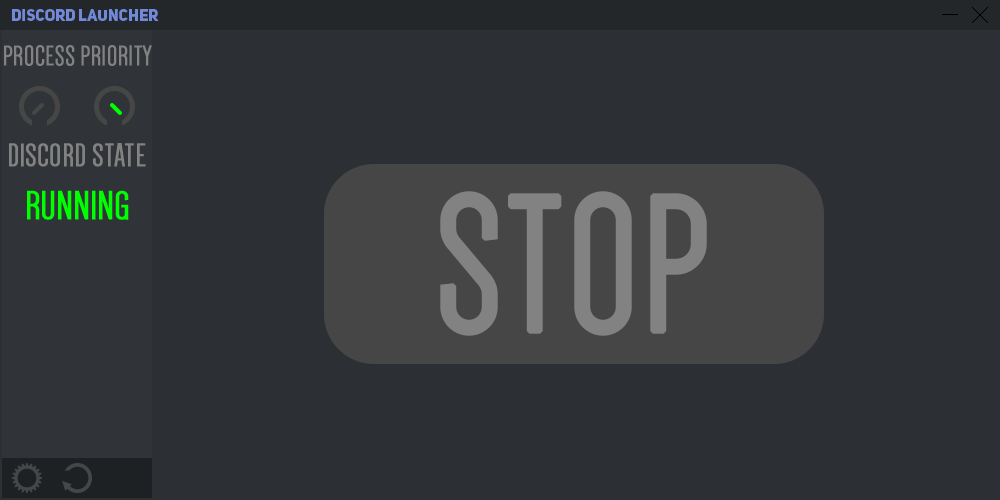
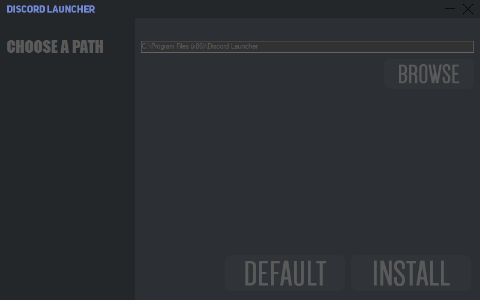
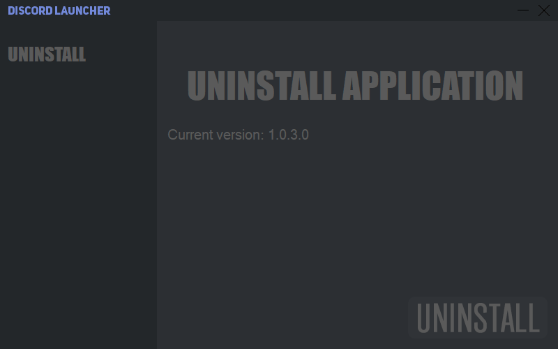

# **Discord Launcher**

## **Why this exists?**
As you may know, to reduce **_CPU usage_** discord processes automaticaly set to a lower priority state. On a low-end computer, this causes **interruptions** in the audio when talking to other people when the **CPU experiences a high load**. 

### **How does it work?**
To mitigate this issue, Discord Launcher **forces discord processes** to stay at a **level of _priority_** chosen by the user.
It uses a **lightweight** process listener module. This application's purpose is to be used on lower-end computers so naturally it's built from the ground up to be **_very light_**.

#### **Why use this as a discord launcher?**

This tool also acts as a fully fledged **launcher** for discord. You might ask yourself why would I complicate my existence by using a launcher to start Discord, but I assure you that **Discord Launcher** can be set-up to be a **1-Click** solution. Who wants to have to open a separate tool every time they use Discord. **Discord Launcher** not only starts Discord, but also starts the priority tool all in a single click!

##### **Who is it for?**

As I said before this launcher is for people with lower-end computers who struggle to keep Discord **responsive** during high CPU load. It can also be used by people that are just looking for a **simple launcher** for Discord.
## **Still not convinced? Check this out!**
### **OFF**
   
### **ON**
   

**As a result Discord will always be responsive, even under high load conditions.**

## **Features**
     
* **Priority state buttons for the automatic process priority setter. (LOW/HIGH)** 
* **Settings button to change the launcher behaviour.** 
* **Application updater service.** 
* **Fully featured application installer built from the ground up specifically to integrate with Discord Launcher and it's update feature.**
* **The application also works as a portable application as it does not require installation.**
## **Screenshots**

* ### _Main menu during normal operation_

* ### _Installer on the installation menu_

* ### _Installer on the uninstallation menu_

# **NO MORE INTERRUPTIONS!**

###### Proudly made by Decemyn -High school student and indie developer-
###### For any inquiries contact me at: radulescudecebal@outlook.com
